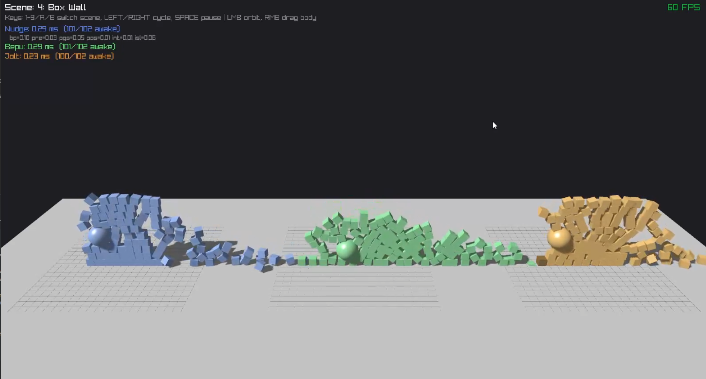

nudge
=====

Small, handle-based 3D rigid body physics engine in C. Tiny API surface, drop
a couple of headers + one translation unit into your project and go.

**[▶ Try it live in the browser](https://randygaul.github.io/nudge/)** -- all
scenes run in WebAssembly; same build as the desktop demo.

```c
#include "nudge.h"

World world = create_world((WorldParams){ .gravity = {0, -9.81f, 0} });

Body floor = create_body(world, (BodyParams){ .mass = 0 }); // mass 0 = static
body_add_shape(world, floor, (ShapeParams){ .type = SHAPE_BOX, .box.half_extents = {10, 0.5, 10} });

Body ball = create_body(world, (BodyParams){ .mass = 1.0f, .position = {0, 5, 0} });
body_add_shape(world, ball, (ShapeParams){ .type = SHAPE_SPHERE, .sphere.radius = 0.5f });

while (running) {
    world_step(world, 1.0f / 60.0f);
    v3 pos = body_get_position(world, ball);
}
destroy_world(world);
```


What you get
------------

### Shapes

Sphere, capsule, box, convex hull, cylinder, static triangle mesh, and
heightfield. Build convex hulls from arbitrary point clouds with `quickhull`,
or use the built-in unit box. One body can hold several child shapes with
local offsets and rotations -- compound colliders come for free.

```c
// Compound: three shapes on one body.
Body robot = create_body(world, (BodyParams){ .mass = 3.0f, .position = {0, 2, 0} });
body_add_shape(world, robot, (ShapeParams){
    .type = SHAPE_BOX, .box.half_extents = {0.3f, 0.5f, 0.2f }
});
body_add_shape(world, robot, (ShapeParams){
    .type = SHAPE_CAPSULE,
    .local_pos = {0.4f, 0.2f, 0},
    .capsule.half_height = 0.3f, .capsule.radius = 0.1f
});
body_add_shape(world, robot, (ShapeParams){
    .type = SHAPE_SPHERE,
    .local_pos = {0, 0.9f, 0},
    .sphere.radius = 0.25f
});

// Build a convex hull from a point cloud.
v3 pts[8] = { ... };
Hull* h = quickhull(pts, 8);
Body rock = create_body(world, (BodyParams){ .mass = 2.0f, .position = {5, 3, 0} });
body_add_shape(world, rock, (ShapeParams){
    .type = SHAPE_HULL, .hull.hull = h, .hull.scale = {1, 1, 1}
});

// Static triangle mesh as level geometry.
TriMesh* terrain = trimesh_create(verts, vert_count, indices, tri_count);
Body ground = create_body(world, (BodyParams){ .mass = 0 });
body_add_shape(world, ground, (ShapeParams){ .type = SHAPE_MESH, .mesh.mesh = terrain });

// Heightfield (compact grid terrain): N*N float heights on a uniform grid.
float heights[64 * 64] = { /* sampled from a heightmap image, etc. */ };
Heightfield* hf = heightfield_create(heights, 64, 1.0f);   // 64x64, 1m cells
Body terrain_b = create_body(world, (BodyParams){ .mass = 0 });
body_add_shape(world, terrain_b, (ShapeParams){ .type = SHAPE_HEIGHTFIELD, .heightfield.hf = hf });
```


### Joints

Ball-socket, distance, hinge, fixed, prismatic, angular motor, twist limit,
cone limit, and swing-twist (ragdoll). Limits and motors on hinge /
prismatic / distance. Optional soft-spring mode (frequency + damping ratio)
on any joint.

```c
// Hinge with angular limits and a motor.
Joint elbow = create_hinge(world, (HingeParams){
    .body_a = upper_arm, .body_b = forearm,
    .local_offset_a = {0, -0.5f, 0}, .local_offset_b = {0, 0.5f, 0},
    .local_axis_a = {1, 0, 0}, .local_axis_b = {1, 0, 0},
});
joint_set_hinge_limits(world, elbow, -1.2f, 2.5f);  // radians
joint_set_hinge_motor(world, elbow, 3.0f, 5.0f);    // speed, max impulse

// Soft distance (rope-spring) with frequency / damping ratio.
create_distance(world, (DistanceParams){
    .body_a = ceiling, .body_b = payload,
    .local_offset_a = {0, 0, 0}, .local_offset_b = {0, 0.5f, 0},
    .rest_length = 2.0f,
    .spring = { .frequency = 3.0f, .damping_ratio = 0.2f }
});
```


### Simulation

Rigid body stacking, friction, restitution, linear / angular damping. Sleep
so stacks and piles stop burning CPU once at rest. Rolling friction for
balls / cylinders that should lose spin on contact. Gyroscopic integration
for tops, cylinders on edge. Picks up free threads when available;
single-threaded works too.

```c
Body die = create_body(world, (BodyParams){
    .mass = 0.8f, .position = {0, 5, 0},
    .friction = 0.6f, .restitution = 0.15f,
    .rolling_friction = 0.04f,      // spin decays once rolling on ground
    .linear_damping = 0.0f, .angular_damping = 0.05f,
});
body_add_shape(world, die, (ShapeParams){ .type = SHAPE_BOX, .box.half_extents = {0.25f, 0.25f, 0.25f} });
```


### Contact reporting

`world_contact_summaries()` returns the current step's collisions sorted by
body pair, deduplicated, with one normal + patch point + radius + depth per
pair. For per-body callbacks, `body_set_contact_listener` fires once per
step with an array of contacts where `self` is always in the `a` slot --
the engine flips normals and swaps fields for you.

```c
void on_player_hit(Body self, const ContactSummary* pairs, int n, void* ud) {
    for (int i = 0; i < n; i++) {
        v3 n = pairs[i].normal;        // points away from self
        float depth = pairs[i].depth;
        uint8_t other_mat = pairs[i].material_b;
        if (depth > 0.1f && pairs[i].normal.y > 0.8f)
            play_landing_sound(other_mat);
    }
}

body_set_contact_listener(world, player, on_player_hit, &game);

// Or poll the sorted buffer after world_step:
int n = 0;
const ContactSummary* s = world_contact_summaries(world, &n);
for (int i = 0; i < n; i++) { /* ... */ }
```


### Materials

World-level palette of 256 entries (friction / restitution / user data).
Bodies carry a default material id, and triangle meshes can carry per-
triangle ids. Contact summaries report the resolved id for each side, so
you can pick audio clips, VFX, or whatever else from a single lookup.

```c
world_set_material(world, 1, (Material){ .friction = 0.9f, .restitution = 0.05f, .user_data = MAT_WOOD });
world_set_material(world, 2, (Material){ .friction = 0.2f, .restitution = 0.30f, .user_data = MAT_ICE });

body_set_material_id(world, crate, 1);

// Per-triangle materials on a trimesh (e.g. grass vs rock patches):
uint8_t tri_mats[tri_count] = { /* one id per triangle */ };
trimesh_set_material_ids(terrain, tri_mats);
```


### Queries

Raycasts and AABB queries today. Sensors are overlapping shapes that never
enter the physics solver -- useful for trigger volumes, damage zones, AI
perception.

```c
RayHit hit;
if (world_raycast(world, V3(0, 10, 0), V3(0, -1, 0), 50.0f, &hit))
    printf("hit body %llu at y=%f\n", hit.body.id, hit.point.y);

Body overlaps[64];
int n = world_query_aabb(world, V3(-5, 0, -5), V3(5, 3, 5), overlaps, 64);

Sensor zone = create_sensor(world, (SensorParams){ .position = {10, 1, 0} });
sensor_add_shape(world, zone, (ShapeParams){ .type = SHAPE_SPHERE, .sphere.radius = 3.0f });
Body bodies_inside[32];
int count = sensor_query(world, zone, bodies_inside, 32);
```


### Persistence

Snapshot save/load is versioned binary. Hulls, triangle
meshes, and heightfields are referenced by name so your asset loader
rebinds them on load. Rewind is a ring buffer of deterministic snapshots
you can jump back to; delta-compressed, so resting piles cost almost
nothing.

```c
// Save / load.
hull_set_name(h, "rock_medium");
trimesh_set_name(terrain, "level1_terrain");
world_register_hull(world, h);
world_register_mesh(world, terrain);
world_save_snapshot(world, "save.nudge");

World w2 = create_world(wp);
world_register_hull(w2, h);
world_register_mesh(w2, terrain);
world_load_snapshot_into(w2, "save.nudge");

// Rewind ring: capture every step, jump back.
world_rewind_init(world, (RewindParams){ .max_frames = 120, .auto_capture = 1 });
uint64_t checkpoint = world_rewind_capture(world);
// ... run some frames ...
world_rewind_to_frame(world, checkpoint);     // bit-identical to the capture
world_rewind_by_steps(world, 30);             // or: jump back 30 steps
```


### Debugging (LLM-first)

The workflow assumes an LLM agent is driving: a deterministic repro, a
named pause point in the test, and a reflected view of engine memory
the agent can query without recompiling.

**DBG_BREAK pause points.** Drop one wherever the symptom first shows:

```c
if (wi->body_state[bi].position.y < -0.3f)
    DBG_BREAK("tunnel:first", *(World*)&w);
```

Run with `--debug --break=tunnel:*` and the test thread parks itself
in a sleep loop when the predicate trips. The agent attaches the viewer
(`tools/viewer.c`), which reads engine memory via `ReadProcessMemory`
against reflected type tables -- bodies, manifolds, contacts, islands,
warm cache, BVH, solver LDL state, narrowphase SAT intermediates. Zero
engine edits to inspect anything new; add a field to a struct and it
shows up in `get` next run.

What the agent sees on attach looks like this:

```
> summary
frame: 54   bodies: 128 (127 awake)   contacts: 312   islands: 4 (4 awake)
step: 1.83 ms   np: 0.41   solve: 1.02   integrate: 0.12

> get body_state 85
position: (-0.761,  -0.124,  4.541)
rotation: ( 0.000,   0.000,  0.000,  1.000)

> get body_hot 85
velocity:         (-1.49, -8.17,  0.08)
angular_velocity: ( 0.00,  0.00,  0.00)

> contacts 85
manifold 0: body_a=85 body_b=-1 (static mesh) contacts=2 normal=(0.00,1.00,0.00)
  [0] point=(-0.76,0.02,4.54) pen=0.019 lambda_n=0.00 feature_id=0x4f12
  [1] point=(-0.74,0.02,4.56) pen=0.017 lambda_n=0.00 feature_id=0x4f13

> get np_debug
body_a=85 body_b=-1 winning_axis=face_a face_a_sep=-0.019 edge_sep=+0.004
contact_normal=(0.00, 1.00, 0.00)   # sane: mesh-up

> continue
```

From that paused state the agent fires hypotheses as queries instead of
rebuilds -- `contacts 85`, `get np_debug`, `table body_hot`, `warm 85` --
and only reaches for cdb when it needs function locals or a callstack.

Two skills ship with the repo under `.claude/`:

- **`remote-debug`** (`/remote-debug <bug>`) -- autonomous end-to-end
  loop. Finds a deterministic repro, isolates one variable at a time,
  measures against expectations, proposes a minimal fix, and re-verifies
  across 15+ varied inputs. This is the default entry point when you
  point Claude at a bug.
- **`physics-debug`** (`/physics-debug <bug>`) -- deeper methodology
  reference: five-phase breakdown, the "break one frame before the
  anomaly" rule, cdb step-through recipes, the impulse-ledger-vs-velocity
  check, and bias guards. `remote-debug` leans on it for the hard cases.

Both assume the TCP debug server (`src/debug_server.c`) and the viewer
(`tools/viewer.c`) -- the infrastructure is in-tree, so `git clone +
cmake --build + /remote-debug` is the whole setup.


### Cross-engine testbed

Same scenes, same initial state, run in nudge / Bepu / Jolt simultaneously
so correctness and perf can be compared at a glance. Native DLLs for nudge
and Jolt are P/Invoked from a C# harness; Bepu is native C#.

[](docs/testbed.mp4)

*Click to play. Scene 4 "Box Wall": each column is a different engine
stepping the same 102 boxes with identical initial conditions.*

Two apps ship in `testbed/`:

- **`Testbed`** -- headless benchmark. Runs a fixed scenario matrix
  (`StackBoxes_100`, `SphereDrop_10x10`, `PyramidBoxes_20`, ...) across
  all three engines with warmup + measure phases, prints avg / min / max
  / p50 / p95 ms per frame.
- **`Testbed.Visual`** -- live side-by-side viewer (Raylib). Scenes
  numbered on the number keys, `LEFT/RIGHT` cycle, `SPACE` pauses, LMB
  orbits, RMB drags a body. Good for "does this engine get the same
  answer as Jolt on scene X" sanity checks.

Build and run:

```sh
# 1. Native DLLs (nudge + Jolt). Bepu is managed so it's pulled by dotnet.
cmake -B testbed/native/build -S testbed/native
cmake --build testbed/native/build --config Release

# 2. C# harness.
dotnet run -c Release --project testbed/src/Testbed          # benchmark tables
dotnet run -c Release --project testbed/src/Testbed.Visual   # live viewer
```


### Cross-platform FP determinism

Simulation is bit-identical across every target the CI matrix covers:
x86_64 (MSVC / GCC / Clang), aarch64 (AppleClang), and wasm32 (emscripten),
with both SIMD and scalar backends. Run the canonical 240-step scene
anywhere and you get the same FNV-1a hash `0xf60bdbc375eb2dcb`; CI asserts
this on every push.

If you're dropping nudge into another project and want to keep that
guarantee, the build has to match these flags.

**Compiler flags** (GCC / Clang / AppleClang / emcc):

```
-ffp-contract=off
-fno-fast-math
-fno-unsafe-math-optimizations
-fno-associative-math
-fno-reciprocal-math
-fno-finite-math-only
-fsigned-zeros
```

Clang-family also needs the two auto-vectorizer disables:

```
-fno-vectorize
-fno-slp-vectorize
```

MSVC: `/fp:precise` (it's default, but be explicit so a future project-
wide `/fp:fast` doesn't silently break determinism).

**Gotchas:**

- **Do not pair `-ffp-contract=off` with `-ffp-model=precise`.** The
  `precise` model implies `-ffp-contract=on` and silently re-enables
  FMA fusion on ARM -- AppleClang at `-O3` will emit `vfmaq_f32` for
  `a*b+c` patterns and you'll diverge from x86. Use one or the other.
- **Keep `#pragma STDC FP_CONTRACT OFF` at the top of the TU** if you
  repackage engine sources into a larger build. `vmath.h` and
  `nudge_internal.h` set it already; the command-line flag alone isn't
  enough on AppleClang.
- **Threading is deterministic** -- `world->thread_count = 8` produces
  the same hash as single-threaded.


### Language / packaging

- Plain C API, easy to bind from other languages.
- Handle-based, foot-gun resistant: stale `Body` / `Joint` / `Sensor`
  handles return inert / zero rather than crashing.
- Header is `extern "C"` and self-contained; `#include "nudge.h"` from a
  C++ TU works with no special flags.
- Shared-library builds: define `NUDGE_BUILD_DLL` when building as a
  shared library and `NUDGE_USE_DLL` when linking against it. Or
  `#define NUDGE_API ...` before including to override entirely.


What's missing
--------------

- Continuous collision (CCD) / swept shape casts.
- Shape-cast and overlap-shape world queries (raycast and AABB query
  work today).
- Character controller, vehicles, soft bodies.


Known issues
------------

- **Cylinder collisions** can jitter or lose contacts on edge-rest poses.
  The native cylinder-vs-{sphere,capsule,box,hull,cyl} paths are newer
  and less battle-tested than the hull-backed fallback; if you hit a
  regression, toggling the native-cyl flags in the debug panel is the
  fastest workaround.
- **LDL solver** is equality-only -- any joint with active limits or a
  motor falls back to PGS for that row, and mixed chains where equality
  and inequality rows share bodies can converge slower than either pure
  solver would alone. Tune `position_iters` / `velocity_iters` upward if
  a specific articulated assembly drifts.


Building
--------

```sh
cmake -B build
cmake --build build
```

C23 compiler required. The engine is a unity build rooted at `src/main.c`.


License
-------

Public domain.
